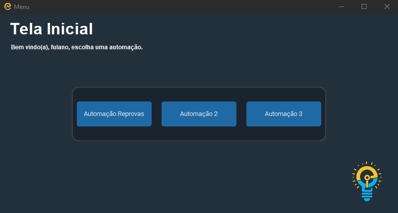
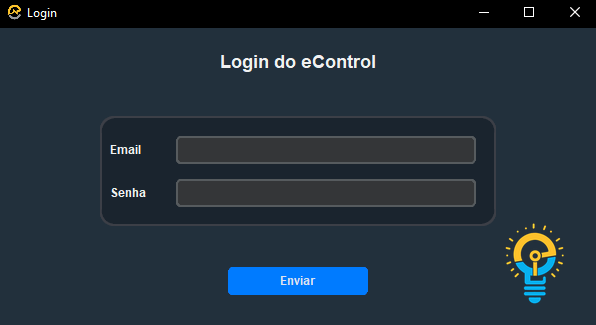
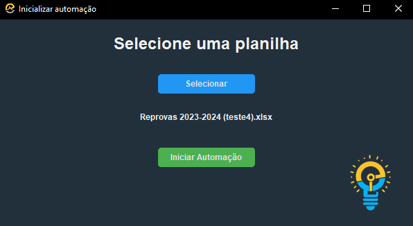

# Molde de Plataforma para Automações

## Descrição
Esta é uma plataforma projetada para organizar e melhorar o fluxo de automação utilizado por alguns funcionários. Com um layout intuitivo e recursos abrangentes, a plataforma visa otimizar processos, aumentar a eficiência e facilitar a gestão das automações.

## Imagens

### Menu Principal

*Descrição: Esta aba permite aos usuários visualizar e gerenciar todas as automações disponíveis.*

### Aba de Login

*Descrição: Esta é a aba de Login para uma das automações até então.*

### Aba de inicialização

*Descrição: Tela onde será selacionado um arquivo excel e inicializada a automação em questão.*

## Contribuições
Contribuições são bem-vindas! Sinta-se à vontade para indicar melhoras ou novas ideias.

